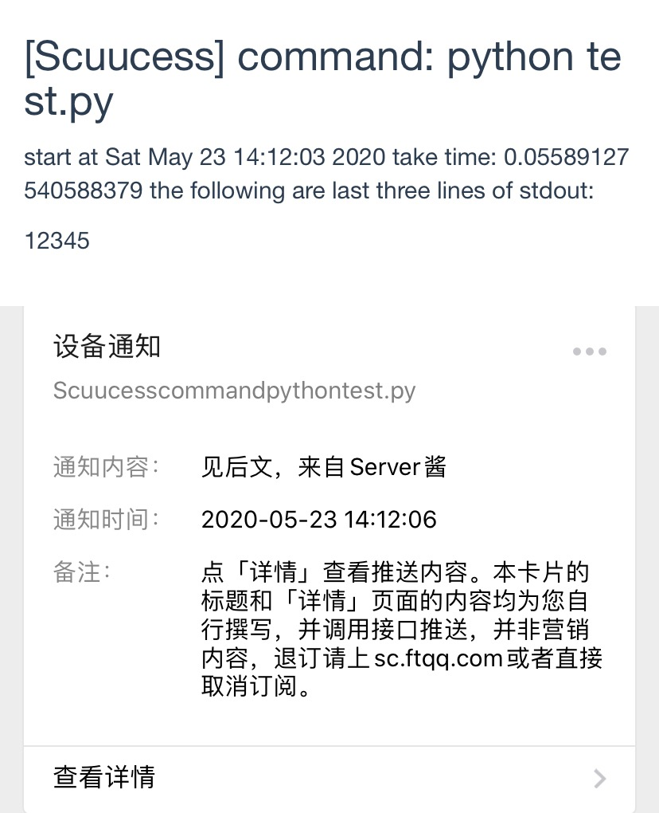
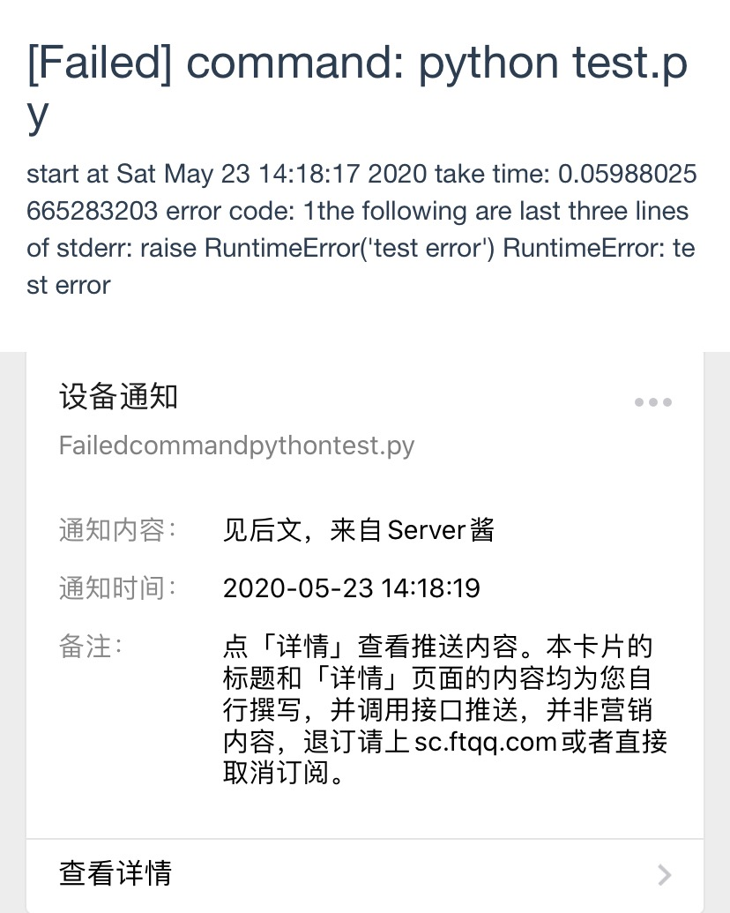
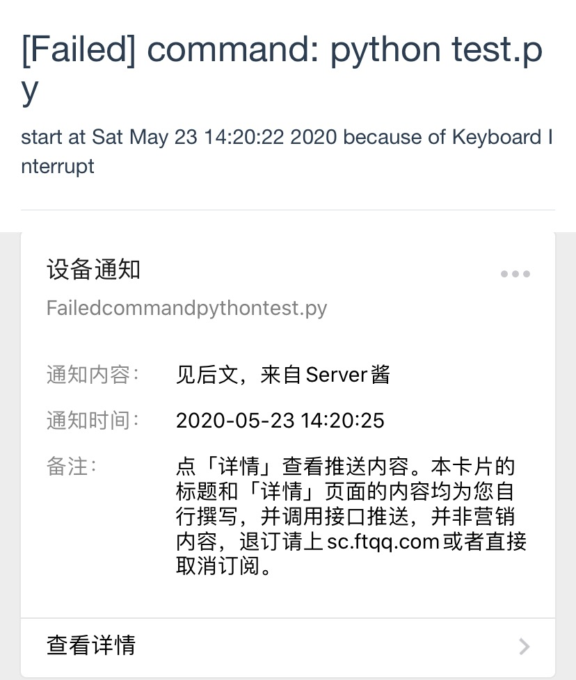

# WECHAT NOTIFY

Many scripts today may take a long time to run, such as deep learning tasks. We wonder to check the results immediately after its accomplishment but keeping an eye on the process is not desirable.

This project is aimed to notify you through WeChat when certain command is completed.

## requirements

This package rely on `requests`.

```bash
pip3 install requests
```

### SERVER CHAN

This project rely on [SERVER CHAN](http://sc.ftqq.com/3.version) to push notifications to WeChat. Please follow the instructions on the website and **set your SCKEY to environment variable** as `SERVER_CHAN_TOKEN`.

Your command's output and error will be write to file `stdout` and `stderr` regardless of whether notification will be push or not.

## usage

```bash
notify [bash command]
```

Note that special chars of bash, such as `>`, need to be escaped so that the script can capture the corrent bash command. For example:

```bash
notify python train.py \> trail.log
```

## example

WECHAT_NOTIFY will push three kinds of notifications.

* [Success]: inform you [what command, start time, how long the command takes, last three lines of output(if exists)]
    
* [Failed]: inform you [what command, start time, how long the command takes, last three lines of stderr(if exists)]
    
    <!--  -->
* [Keyboard Interrupt]: inform you [what command, start time, 'Keyboard Interrupt']
    
    <!--  -->

## TODO

- [ ] unit test
- [ ] Email support
- [ ] test on WeChat Work
